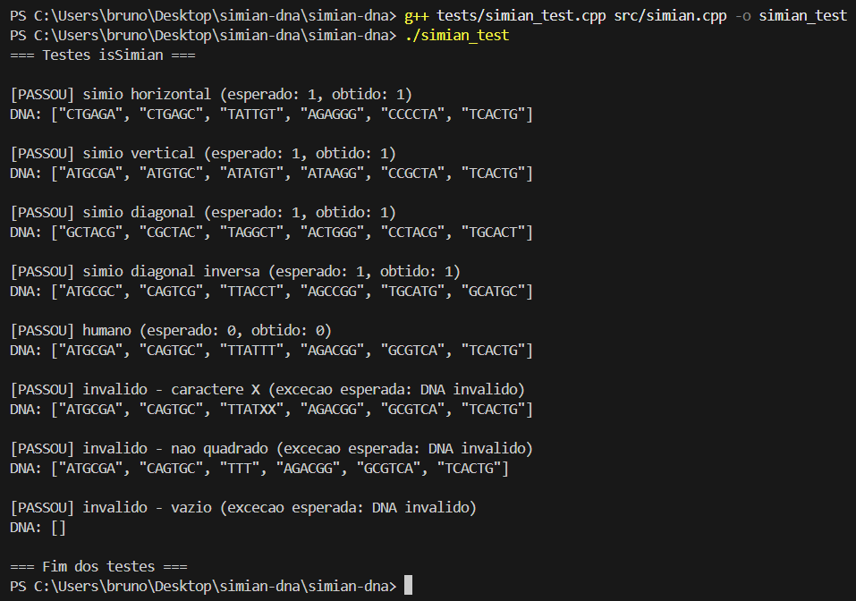
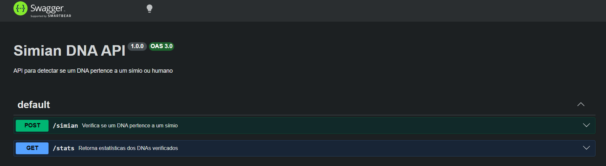
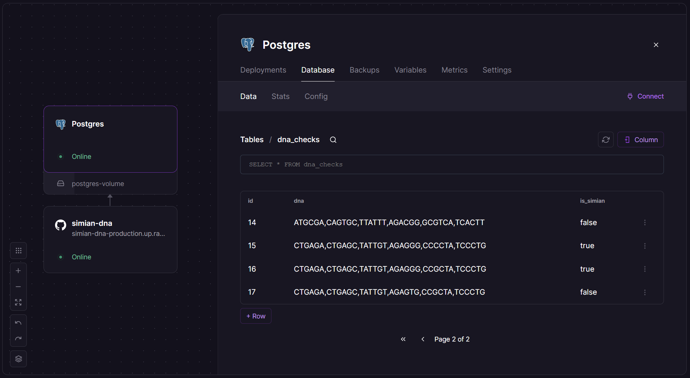

# simian-dna
Simian DNA detection algorithm and API challenge

Aplicação que detecta se uma sequência de DNA pertence a um símio ou humano.

O sistema analisa uma matriz NxN contendo bases nitrogenadas (A, T, C, G) e determina se pertence a um símio ao encontrar uma ou mais sequências de quatro letras iguais nas direções horizontal, vertical ou diagonal.

## Tecnologias utilizadas

- C++17
- Node.js
- Express
- PostgreSQL
- Swagger
- Railway

## Arquitetura

O projeto foi dividido em duas partes:

- **C++**: implementação do algoritmo principal (`isSimian`), com foco em performance e testes
- **Node.js**: API REST responsável por receber requisições HTTP e retornar os resultados

> A lógica do algoritmo foi replicada em JavaScript para uso na API.

## Algoritmo em C++

### Pré-requisitos
- g++ com suporte a C++17

### Como compilar e rodar
> Execute os comandos abaixo no terminal, na raiz do projeto.

#### Programa principal

**Compilar:**
```bash
g++ src/main.cpp src/simian.cpp -o simian
```

**Executar:**
```bash
simian        # Windows (PowerShell/CMD)
./simian      # Linux/Mac/Git Bash
```

#### Testes

**Compilar:**
```bash
g++ tests/simian_test.cpp src/simian.cpp -o simian_test
```

**Executar:**
```bash
simian_test   # Windows (PowerShell/CMD)
./simian_test # Linux/Mac/Git Bash
```



## API REST em Node.js

API REST desenvolvida em Node.js com Express, hospedada no Railway.

### URL pública
https://simian-dna-production.up.railway.app

> **Nota:** a API está hospedada no plano gratuito do Railway e pode demorar alguns segundos para responder na primeira requisição.

### Pré-requisitos
- Node.js v22+
- npm v10+

### Como rodar localmente
> Execute os comandos abaixo no terminal, na raiz do projeto.
```bash
npm install
npm run dev
```

### Documentação Swagger
- Local: http://localhost:3000/api-docs
- Cloud: https://simian-dna-production.up.railway.app/api-docs



### Endpoints

**POST /simian**
```json
{
  "dna": ["ATGCGA", "CAGTGC", "TTATGT", "AGAAGG", "CCCCTA", "TCACTG"]
}
```
Retorna `200 OK` se símio, `403 Forbidden` se humano, `400 Bad Request` se DNA inválido.

**GET /stats**

Retorna estatísticas dos DNAs verificados:
```json
{"count_mutant_dna": 1, "count_human_dna": 1, "ratio": 1}
```

### Testando a API
```bash
# DNA símio — esperado: 200 OK
curl -i -X POST https://simian-dna-production.up.railway.app/simian -H "Content-Type: application/json" -d "{\"dna\": [\"CTGAGA\", \"CTGAGC\", \"TATTGT\", \"AGAGGG\", \"CCCCTA\", \"TCACTG\"]}"

# DNA humano — esperado: 403 Forbidden
curl -i -X POST https://simian-dna-production.up.railway.app/simian -H "Content-Type: application/json" -d "{\"dna\": [\"ATGCGA\", \"CAGTGC\", \"TTATTT\", \"AGACGG\", \"GCGTCA\", \"TCACTG\"]}"

# DNA inválido — esperado: 400 Bad Request
curl -i -X POST https://simian-dna-production.up.railway.app/simian -H "Content-Type: application/json" -d "{\"dna\": [\"ATGCGA\", \"CAGTGC\", \"TTATXX\", \"AGACGG\", \"GCGTCA\", \"TCACTG\"]}"

# Stats — esperado: 200 OK
curl -i https://simian-dna-production.up.railway.app/stats
```

## Banco de dados

Banco de dados PostgreSQL hospedado no Railway, integrado à API. Garante unicidade dos DNAs verificados e cada DNA é armazenado apenas uma vez.

